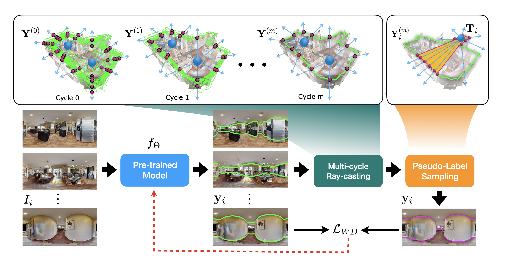

# Self-training Room Layout Estimation via Geometry-aware Ray-casting [ECCV 2024].

<p align="center">

</p>
<!-- 
<div align="center">
https://arxiv.org/abs/2407.15041
[](https://arxiv.org/pdf/2409.04410)&nbsp;
</div> -->

<div align="center">

> [**Self-training Room Layout Estimation via Geometry-aware Ray-casting**](https://enriquesolarte.github.io/ray-casting-mlc/)<br>
> [Bolivar Solarte](), [Chin-Hsuan Wu](), [Jin-Cheng Jhang](), [Jonathan Lee](), [Yi-Hsuan Tsai](), [Min Sun]()
> <br>National Tsinghua University, Industrial Technology Research Institute ITRI (Taiwan) and Google<br>
</div>

This is the implementation of our proposes algorithm **Multi-cycle ray-casting** to creating pseudo-labels for self-training 360-room layout models.


## Installation

For convenience, we recommend using `conda` to create a new environment for this project.
```bash
conda create -n ray-casting-mlc python=3.9
conda activate ray-casting-mlc
```

### Install ray-casting-mlc

For reproducibility, we recommend creating a workspace directory where the datasets, pre-trained models, training results, and other files will be stored. In this description, we assume that `${HOME}/ray_casting_mlc_ws` is the workspace.

```bash
mkdir -p ${HOME}/ray_casting_mlc_ws

cd ${HOME}/ray_casting_mlc_ws
git clone https://github.com/EnriqueSolarte/ray_casting_mlc
cd ray_casting_mlc

# To bring the registered submodules HorizonNet and LGTNet from the original implementations
git submodule update --init --recursive
pip install . 
```

## Download the MLV-Datasets

<p align="center">

</p>
<div align="center">

> [**MLV-Datases** in Huggingface 🤗🤗🤗🤗🤗](https://huggingface.co/datasets/EnriqueSolarte/mvl_datasets)
</div>


With the publication of this project, we release a new dataset called `hm3d_mvl`. This dataset complements previous panorama datasets by adding multiple registered views as inputs for the task of  self-training room layout estimation. This dataset can be downloaded using the following command:

```bash
# Downloading the dataset hm3d_mvl
python experiments/download/mvl_datasets.py dataset=hm3d_mvl
```
Using the format, we also provide the `mp3d_fpe_mvl` and `zind_mvl` datasets processed from the official repositories [360-MLC](https://github.com/EnriqueSolarte/360-mlc) and [ZiND](https://github.com/zillow/zind), respectively. For convenience, we called these datasets as multi-view-layout datasets `mvl-datasets`. These datasets are public available in [**MLV-Datases** (Huggingface 🤗)](https://huggingface.co/datasets/EnriqueSolarte/mvl_datasets). To download these datasets, use the following commands:

```bash
# Downloading the dataset mp3d_fpe_mvl
python experiments/download/mvl_datasets.py dataset=mp3d_fpe_mvl
# Downloading the dataset zind_mvl
python experiments/download/mvl_datasets.py dataset=zind_mvl
# Downloading the all mvl-datasets
python experiments/download/mvl_datasets.py dataset=main
```
## Download the pre-trained models

We provide pre-trained models for [LGTNet](https://github.com/zhigangjiang/LGT-Net) and [HorizonNer](https://github.com/sunset1995/HorizonNet) models. These pretrained weights are taken from officially repositories provided by the authors.  These models can be downloaded using the following command:

```bash
python experiments/download/pre_trained_models.py
```

## Create Pseudo-labels

After downloading the datasets, we can create the pseudo-labels using [LGTNet](https://github.com/zhigangjiang/LGT-Net) model as follows:

```bash
# To precomputed 360-MLC pseudo labels. This is needed for initializing multi-cycle ray-casting process.
python experiments/lgt_net/pre_compute_mlc.py dataset=hm3d_mvl

# To precomputed estimations from a pre-trained model
python experiments/lgt_net/pre_compute_xyz.py dataset=hm3d_mvl

# To run multi-cycle ray-casting process
python experiments/lgt_net/multi_cycle_ray_casting.py dataset=hm3d_mvl

# To build pseudo labels for the self-training process
python experiments/lgt_net/sampling_ray_casting_pseudo_labels.py dataset=hm3d_mvl
```
For convenience, we also provide similar scripts for [HorizonNer](https://github.com/sunset1995/HorizonNet) model. 


## Run Self-training

After creating the pseudo-labels, we can run the self-training process using the following command:

```bash
python experiments/lgt_net/train/train_lgt_net_xyz.py dataset=hm3d_mvl
```
Results will be saved in the ``${HOME}/ray_casting_mlc_ws/train_results` directory.

## Citation

For the `hm3d-mvl` dataset and `Multi-cycle ray-casting` please cite the following paper:

```bibtex
@article{solarte2024_ray_casting_mlc,
    title   ={Self-training Room Layout Estimation via Geometry-aware Ray-casting}, 
    author  ={Bolivar Solarte and Chin-Hsuan Wu and Jin-Cheng Jhang and Jonathan Lee and Yi-Hsuan Tsai and Min Sun},
    year    ={2024},
    url     ={https://arxiv.org/abs/2407.15041}, 
}
```

For the `mp3d-fpe-mvl` dataset please cite the following paper:
```bibtex
@article{Solarte2022_360_MLC,
    title   ={360-mlc: Multi-view layout consistency for self-training and hyper-parameter tuning},
    author  ={Solarte, Bolivar and Wu, Chin-Hsuan and Liu, Yueh-Cheng and Tsai, Yi-Hsuan and Sun, Min},
    journal ={Advances in Neural Information Processing Systems (NeurIPS)},
    volume  ={35},
    pages   ={6133--6146},
    year    ={2022}
}
```

For the `zind-mvl` dataset please cite the following paper:
```bibtex
@inproceedings{ZInD,
  title     = {Zillow Indoor Dataset: Annotated Floor Plans With 360º Panoramas and 3D Room Layouts},
  author    = {Cruz, Steve and Hutchcroft, Will and Li, Yuguang and Khosravan, Naji and Boyadzhiev, Ivaylo and Kang, Sing Bing},
  booktitle = {Proceedings of the IEEE/CVF Conference on Computer Vision and Pattern Recognition (CVPR)},
  month     = {June},
  year      = {2021},
  pages     = {2133--2143}
}
```
