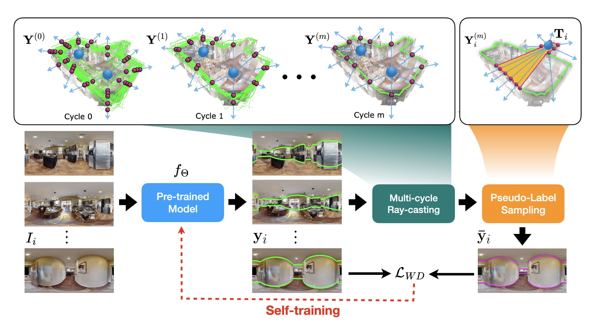

# Self-training Room Layout Estimation via Geometry-aware Ray-casting [ECCV 2024].

<p align="center">

</p>
<!-- 
<div align="center">
https://arxiv.org/abs/2407.15041
[](https://arxiv.org/pdf/2409.04410)&nbsp;
</div> -->

<div align="center">

> [**Self-training Room Layout Estimation via Geometry-aware Ray-casting**](https://enriquesolarte.github.io/ray-casting-mlc/)<br>
> [Bolivar Solarte](), [Chin-Hsuan Wu](), [Jin-Cheng Jhang](), [Jonathan Lee](), [Yi-Hsuan Tsai](), [Min Sun]()
> <br>National Tsinghua University, Industrial Technology Research Institute ITRI (Taiwan) and Google<br>
</div>

This is the implementation of our proposes algorithm **Multi-cycle ray-casting** to creating pseudo-labels for self-training 360-room layout models.


## Installation

For convenience, we recommend using `conda` to create a new environment for this project.
```bash
conda create -n ray-casting-mlc python=3.9
```